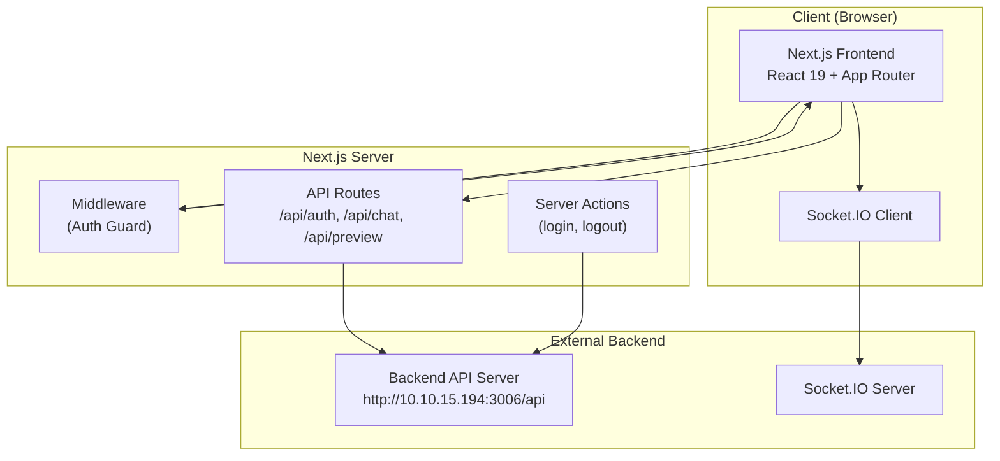
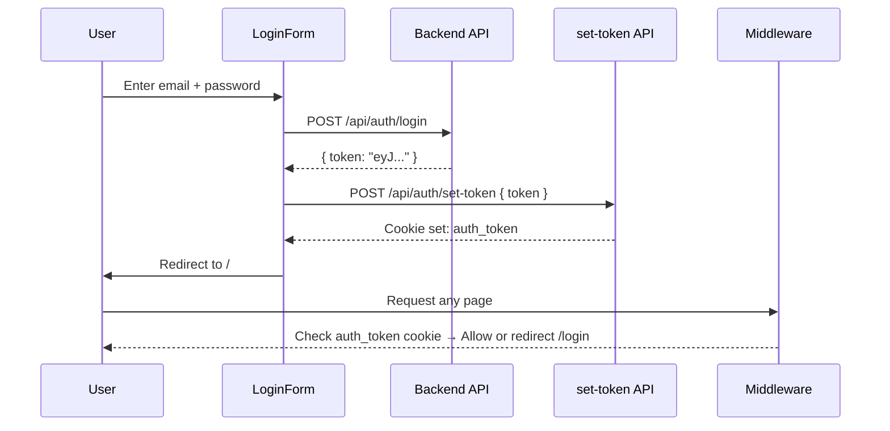
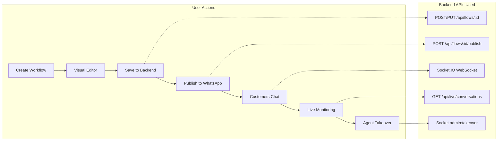

# Slash ChatBot — Codebase Documentation

## 1. Project Overview

**Slash ChatBot** is a full-stack chatbot management portal built with **Next.js 16**. It provides an admin dashboard for designing visual chatbot workflows, publishing them to messaging platforms (WhatsApp, Instagram, Web), monitoring live conversations in real-time, and managing media assets.

The frontend communicates with a backend API server at `http://10.10.15.194:3006/api` for all business logic, data persistence, and messaging platform integrations.

---

## 2. Tech Stack

| Layer | Technology |
|---|---|
| **Framework** | Next.js 16.1.1 (App Router, Turbopack) |
| **UI Library** | React 19.2.3 |
| **Styling** | Tailwind CSS v4 + `tailwindcss-animate` |
| **Component Library** | shadcn/ui (53 Radix-based components) |
| **Workflow Builder** | `@xyflow/react` v12 (React Flow) |
| **Charts** | Recharts v2 |
| **Real-time** | Socket.IO Client v4 |
| **Forms** | React Hook Form v7 + Zod v4 |
| **Fonts** | Outfit (sans), JetBrains Mono (mono), Knewave, Oswald |
| **Linting** | Biome v2.2.0 |
| **Notifications** | Sonner v2 (toast) |

---

## 3. Project Structure

```
e:\chatbot\
├── .env / .env.local          # Environment config
├── next.config.mjs            # Next.js configuration
├── package.json               # Dependencies & scripts
├── biome.json                 # Linter/formatter config
├── public/                    # Static assets (logos, icons, chat widget)
│   ├── SlashLogo.svg / .png
│   ├── chat-widget.js         # Embeddable web chat widget (22 KB)
│   ├── test-widget.html       # Widget test page
│   ├── whatsapp-icon.svg
│   └── instagram.svg
│
└── src/
    ├── middleware.js           # Auth guard middleware
    ├── app/
    │   ├── layout.js           # Root layout (fonts, Toaster)
    │   ├── page.js             # Home → redirects to Dashboard
    │   ├── globals.css         # Design tokens (light/dark themes)
    │   ├── (auth)/             # Auth route group
    │   │   └── login/page.js   # Login page
    │   ├── (main)/             # Authenticated route group
    │   │   ├── layout.js       # Sidebar + Breadcrumbs layout
    │   │   ├── dashboard/      # Dashboard page
    │   │   ├── workflows/      # Workflow list + editor
    │   │   ├── integrations/   # Platform integrations
    │   │   ├── chat/           # Chat preview
    │   │   ├── live-chat/      # Real-time chat monitor
    │   │   ├── media/          # Media gallery
    │   │   └── settings/       # User settings
    │   └── api/                # API route handlers
    │       ├── auth/           # Login + set-token
    │       ├── chat/           # Chat session proxy
    │       └── preview/        # Preview session (mock)
    │
    ├── components/
    │   ├── app-sidebar.js      # Navigation sidebar
    │   ├── breadcrumbs.jsx     # Dynamic breadcrumb trail
    │   ├── AgentRequestCard.jsx # Agent request queue card
    │   ├── auth/LoginForm.js   # Login form component
    │   └── ui/                 # 53 shadcn/ui components
    │
    ├── contexts/
    │   └── BreadcrumbContext.js # Breadcrumb state management
    │
    ├── hooks/
    │   ├── use-mobile.js       # Mobile breakpoint detection
    │   └── useLiveChat.js      # Live chat socket management
    │
    ├── lib/
    │   ├── auth.js             # Client-side token extraction
    │   ├── utils.js            # cn() utility (clsx + twMerge)
    │   ├── renderMessage.js    # Message rendering logic
    │   └── actions/auth.js     # Server actions (login, logout)
    │
    └── services/
        ├── socket.js           # Socket.IO connection manager
        └── liveChat.js         # REST API helpers for live chat
```

---

## 4. Architecture Overview



### Key Architectural Patterns

1. **Route Groups** — `(auth)` and `(main)` separate public and authenticated layouts
2. **Middleware Auth Guard** — Checks `auth_token` cookie; redirects unauthenticated users to `/login`
3. **Backend Proxy** — Next.js API routes proxy requests to the external backend (avoids CORS, centralizes auth)
4. **Real-time via Socket.IO** — Live chat uses WebSocket with JWT authentication
5. **Design Token System** — OKLCH color system with light/dark theme support in `globals.css`

---

## 5. Authentication System

### Flow



### Key Files

| File | Purpose |
|---|---|
| [middleware.js](file:///e:/chatbot/src/middleware.js) | Guards all routes except `/api`, `/_next`, static assets. Redirects to `/login` if no `auth_token` cookie. |
| [LoginForm.js](file:///e:/chatbot/src/components/auth/LoginForm.js) | Client component — calls backend directly, finds JWT recursively, sets cookie via `/api/auth/set-token`. |
| [actions/auth.js](file:///e:/chatbot/src/lib/actions/auth.js) | Server actions: `login()`, `logout()`, `getSession()`. Uses `cookies()` API. |
| [auth.js](file:///e:/chatbot/src/lib/auth.js) | Client-side `getAuthToken()` — extracts token from `document.cookie`, strips `Bearer ` prefix. |
| [set-token/route.js](file:///e:/chatbot/src/app/api/auth/set-token/route.js) | API route — sets `auth_token` cookie with `httpOnly: false`. |
| [login/route.js](file:///e:/chatbot/src/app/api/auth/login/route.js) | API route — proxies login to backend, sets `httpOnly: true` cookie. |

> [!NOTE]
> There are two login paths: the **LoginForm** calls the backend directly and uses `/api/auth/set-token`, while the **API route** at `/api/auth/login` also exists as an alternative server-side proxy. The LoginForm path is the active one.

---

## 6. Application Pages

### 6.1 Dashboard — `/dashboard`

**File:** [page.js](file:///e:/chatbot/src/app/(main)/dashboard/page.js)

Displays an overview with:
- **4 stat cards**: Total Workflows, Active Users, Messages Sent, Engagement Rate
- **Bar chart** (Recharts): Desktop vs Mobile traffic over 6 months
- **Recent activity** list with user names and transaction amounts

> [!NOTE]
> Currently uses **hardcoded/mock data**. Not connected to backend analytics APIs.

---

### 6.2 Workflows — `/workflows`

**File:** [page.js](file:///e:/chatbot/src/app/(main)/workflows/page.js)

Lists all chatbot workflows fetched from `GET /api/flows`:
- **Search** with live dropdown suggestions (top 5 matches)
- **Sort** by name, date, status, or node count
- **Card grid** showing name, description, node count, last modified date, status badge (Active/Draft)
- **Actions menu**: Edit (links to workflow editor), Delete (with confirmation dialog)
- **Create Workflow** button → navigates to `/workflows/new`

**API Calls:**
| Method | Endpoint | Purpose |
|---|---|---|
| `GET` | `/api/flows` | Fetch all workflows |
| `DELETE` | `/api/flows/:id` | Delete a workflow |

---

### 6.3 Workflow Editor — `/workflows/[id]`

**Files:**
- [page.js](file:///e:/chatbot/src/app/(main)/workflows/[id]/page.js) — Main editor (985 lines)
- [node-sidebar.js](file:///e:/chatbot/src/app/(main)/workflows/[id]/node-sidebar.js) — Draggable node palette
- [custom-node.js](file:///e:/chatbot/src/app/(main)/workflows/custom-node.js) — Node renderer (190 lines)
- [nodes/](file:///e:/chatbot/src/app/(main)/workflows/nodes/) — 11 individual node components

A visual flow editor powered by **React Flow** (`@xyflow/react`):

#### Features
- **Drag-and-drop** nodes from the sidebar onto the canvas
- **Edge splitting** — dropping a node on an existing edge inserts it inline
- **Placeholder nodes** — dragging an edge to empty space creates a placeholder
- **Auto-layout** — BFS-based layout algorithm for flows without saved positions
- **Metadata dialog** — name & description for new workflows
- **Save** — serializes the visual graph back to the backend's node/edge format

#### Node Types

| Node Type | Component | Purpose |
|---|---|---|
| `start` | (inline) | Flow entry point (green) |
| `message` | [MessageNode.js](file:///e:/chatbot/src/app/(main)/workflows/nodes/MessageNode.js) | Send text/image/document message |
| `question` | [QuestionNode.js](file:///e:/chatbot/src/app/(main)/workflows/nodes/QuestionNode.js) | Ask user a question, store answer in variable |
| `buttons` | [ButtonsNode.js](file:///e:/chatbot/src/app/(main)/workflows/nodes/ButtonsNode.js) | Interactive buttons with branching |
| `list` | [ListNode.js](file:///e:/chatbot/src/app/(main)/workflows/nodes/ListNode.js) | Interactive list menu with sections and rows |
| `condition` | [ConditionNode.js](file:///e:/chatbot/src/app/(main)/workflows/nodes/ConditionNode.js) | If/Else branching with conditions (True/False handles) |
| `webhook` | [WebhookNode.js](file:///e:/chatbot/src/app/(main)/workflows/nodes/WebhookNode.js) | HTTP API call (GET/POST/PUT/DELETE) with headers, params, body |
| `delay` | [DelayNode.js](file:///e:/chatbot/src/app/(main)/workflows/nodes/DelayNode.js) | Wait N seconds |
| `talk_to_agent` | [TalkToAgentNode.js](file:///e:/chatbot/src/app/(main)/workflows/nodes/TalkToAgentNode.js) | Transfer to human agent with wait/timeout messages |
| `ai_bot` | [AiBotNode.js](file:///e:/chatbot/src/app/(main)/workflows/nodes/AiBotNode.js) | AI model integration with system prompt and exit keywords |
| `end` | [EndNode.js](file:///e:/chatbot/src/app/(main)/workflows/nodes/EndNode.js) | Flow termination (red) |
| `placeholder` | [PlaceholderNode.js](file:///e:/chatbot/src/app/(main)/workflows/nodes/PlaceholderNode.js) | Temporary "Add Node" placeholder |

#### Save Logic (Serialization)

The editor converts the React Flow graph into a backend-compatible format:

1. **Nodes** → Each is serialized with `id`, `type`, `data`, `position`, `measured`, and `next` (derived from outgoing edges)
2. **Branching nodes** (buttons, list, condition) → Their internal items get `next` fields from edge connections
3. **Traversal order** → Nodes are sorted via DFS from root nodes for consistent execution order
4. **New workflows** → `POST /api/flows` with `flow_name`, `flow_description`, `channel: "whatsapp"`
5. **Existing workflows** → `PUT /api/flows/:id`

---

### 6.4 Integrations — `/integrations`

**File:** [page.js](file:///e:/chatbot/src/app/(main)/integrations/page.js)

Manages platform connections with 3 integration cards:

#### WhatsApp Integration
- View published workflows in a table
- Publish a new workflow: select flow + enter WhatsApp number
- Unpublish a workflow
- API: `POST /api/flows/:id/publish`, `POST /api/flows/:id/unpublish`

#### Instagram Integration
- Basic configuration form (username input)
- Currently a **placeholder** — no real backend integration

#### Web Chat Widget
- Select a workflow to generate embeddable HTML/JS code
- Copy-to-clipboard functionality
- Generates a `<script>` tag that loads `chat-widget.js` from the app's public directory

---

### 6.5 Chat Preview — `/chat`

**File:** [page.js](file:///e:/chatbot/src/app/(main)/chat/page.js)

A test chat interface to preview bot workflows:

- Starts a **preview session** via `POST /api/preview/start` with a hardcoded flow ID
- Sends messages via `POST /api/preview/:session_id/message`
- Displays messages with user/bot avatars, timestamps, typing indicator
- Auto-scrolls to latest message

> [!IMPORTANT]
> The preview API routes return **mock responses** (e.g., "Welcome! What's your name?", "Nice to meet you, {name}!"). They do not run the actual workflow engine.

---

### 6.6 Live Chat — `/live-chat`

**File:** [page.js](file:///e:/chatbot/src/app/(main)/live-chat/page.js) (757 lines)

Full real-time chat monitoring system with a two-panel layout:

#### Flow Selection Screen
- Fetches published workflows from `GET /api/flows`
- Shows cards with flow name, description, conversation count
- Click to start monitoring

#### Chat Monitoring (after selecting a flow)
- **Left panel**: Active conversation list with search, status badges (Bot Active / Agent / Waiting / Completed)
- **Right panel**: Message history with rich rendering (text, buttons, lists, images, documents)
- **Agent Requests Queue**: Shows incoming `pending_agent` requests with countdown timers (60s timeout)
- **Takeover/Handback**: Admin can take control from the bot, send messages, and hand back

#### Message Types Rendered
- `text` — Plain text bubble
- `buttons` — Text with interactive button badges
- `list` — Text with section rows
- `image` — Inline image with caption
- `document` — File link with icon

#### Button/List ID Resolution
When a user selects a button or list item, the system receives the item ID. The `resolveButtonId()` function walks backwards through message history to find the original interactive message and resolve the ID to its display title.

---

### 6.7 Media Gallery — `/media`

**File:** [page.js](file:///e:/chatbot/src/app/(main)/media/page.js)

Image asset management:
- **Grid gallery** with hover effects (zoom, overlay)
- **Upload** images via `POST /api/media/upload` (FormData)
- **Copy URL** to clipboard (with fallback for older browsers)
- **AuthImage component** — Custom image loader that fetches images with `Authorization` header and creates blob URLs
- API: `GET /api/media/`, `POST /api/media/upload`

---

### 6.8 Settings — `/settings`

**File:** [page.js](file:///e:/chatbot/src/app/(main)/settings/page.js)

Static settings page with:
- **Profile card**: Name and email inputs (hardcoded defaults)
- **Notifications card**: Email and push notification toggles

> [!NOTE]
> This is a **UI-only placeholder**. The "Save Changes" button has no handler and no backend integration.

---

## 7. Shared Components

### 7.1 App Sidebar

**File:** [app-sidebar.js](file:///e:/chatbot/src/components/app-sidebar.js)

Navigation sidebar with 7 menu items:
| Menu Item | Route | Icon |
|---|---|---|
| Dashboard | `/dashboard` | LayoutDashboard |
| Workflows | `/workflows` | GitGraph |
| Integrations | `/integrations` | MessageCircle |
| Chat Preview | `/chat` | MessagesSquare |
| Live Chat | `/live-chat` | Radio |
| Settings | `/settings` | Settings |
| Media | `/media` | Image |

Also includes a **Logout** button at the bottom that clears the `auth_token` cookie and redirects to `/login`.

Active item is highlighted based on `usePathname()`.

### 7.2 Breadcrumbs

**File:** [breadcrumbs.jsx](file:///e:/chatbot/src/components/breadcrumbs.jsx)

Dynamic breadcrumb trail that:
- Parses the current URL path into segments
- Capitalizes segment names by default
- Supports custom titles via `BreadcrumbContext` (used by the workflow editor to show workflow names instead of UUIDs)

### 7.3 AgentRequestCard

**File:** [AgentRequestCard.jsx](file:///e:/chatbot/src/components/AgentRequestCard.jsx)

A card displayed in the Live Chat agent request queue:
- Shows customer name, phone, preview messages
- **Countdown timer** (60s) with urgency coloring (normal → warning → urgent)
- Accept and Reject buttons (disabled when timer reaches 0)

### 7.4 UI Components (shadcn/ui)

The project includes **53 pre-built UI components** in `src/components/ui/`:

`accordion`, `alert-dialog`, `alert`, `aspect-ratio`, `avatar`, `badge`, `breadcrumb`, `button-group`, `button`, `calendar`, `card`, `carousel`, `chart`, `checkbox`, `collapsible`, `command`, `context-menu`, `dialog`, `drawer`, `dropdown-menu`, `empty`, `field`, `form`, `hover-card`, `input-group`, `input-otp`, `input`, `item`, `kbd`, `label`, `menubar`, `navigation-menu`, `pagination`, `popover`, `progress`, `radio-group`, `resizable`, `scroll-area`, `select`, `separator`, `sheet`, `sidebar` (20 KB), `skeleton`, `slider`, `sonner`, `spinner`, `switch`, `table`, `tabs`, `textarea`, `toggle-group`, `toggle`, `tooltip`

---

## 8. Custom Hooks

### 8.1 `useLiveChat(flowId)`

**File:** [useLiveChat.js](file:///e:/chatbot/src/hooks/useLiveChat.js) (292 lines)

The core hook powering the Live Chat page. Manages:

**State:**
- `conversations` — List of active conversations
- `activeConversation` — Currently selected conversation
- `messages` — Messages for the active conversation
- `mode` — `"active"` (bot) or `"takeover"` (agent)
- `isConnected` — Socket connection status
- `agentRequests` — Queue of pending agent transfer requests

**Socket Events Handled:**

| Event | Direction | Purpose |
|---|---|---|
| `admin:join_live` | Emit | Subscribe to flow's live events |
| `admin:joined` | Receive | Initial conversation list |
| `admin:incoming_message` | Receive | New user message |
| `admin:bot_response` | Receive | Bot auto-reply |
| `admin:takeover` | Emit | Take over a conversation |
| `admin:takeover_confirmed` | Receive | Takeover acknowledged |
| `admin:customer_reply` | Receive | User message during takeover |
| `admin:send_message` | Emit | Agent sends message |
| `admin:message_sent` | Receive | Message delivery confirmed |
| `admin:handback` | Emit | Return control to bot |
| `admin:handback_confirmed` | Receive | Handback acknowledged |
| `admin:agent_request` | Receive | New agent transfer request |
| `admin:accept_agent_request` | Emit | Accept agent request |
| `admin:reject_agent_request` | Emit | Reject agent request |
| `admin:agent_request_timeout` | Receive | Request expired |
| `admin:conversation_completed` | Receive | Conversation ended |
| `admin:error` | Receive | Server error |

**Returned Actions:**
- `selectConversation(conv)` — Fetches message history via REST
- `takeover(convId)` / `handback(convId)` — Agent control
- `sendMessage(convId, text)` — Send agent message
- `acceptAgentRequest(convId)` / `rejectAgentRequest(convId)` — Handle queue

### 8.2 `useIsMobile()`

**File:** [use-mobile.js](file:///e:/chatbot/src/hooks/use-mobile.js)

Returns `true` if viewport width is below 768px. Uses `matchMedia` for efficient listening.

---

## 9. Services

### 9.1 Socket Service

**File:** [socket.js](file:///e:/chatbot/src/services/socket.js)

Singleton Socket.IO client:
- Connects to `NEXT_PUBLIC_URL` (with `/api` path stripped)
- Authenticates via `auth: { token: adminJwt }`
- WebSocket transport only, 5 reconnection attempts
- Exports: `connectSocket(jwt)`, `getSocket()`, `disconnectSocket()`

### 9.2 Live Chat REST Service

**File:** [liveChat.js](file:///e:/chatbot/src/services/liveChat.js)

REST API wrappers for live chat operations (used as fallbacks or initial data fetches):

| Function | Method | Endpoint |
|---|---|---|
| `fetchConversations(flowId)` | GET | `/live/conversations?flowId=` |
| `fetchMessages(convId)` | GET | `/live/conversations/:id/messages` |
| `apiTakeover(convId)` | POST | `/live/conversations/:id/takeover` |
| `apiHandback(convId)` | POST | `/live/conversations/:id/handback` |
| `apiSendMessage(convId, text)` | POST | `/live/conversations/:id/message` |

---

## 10. API Routes (Next.js)

### 10.1 Auth Routes

| Route | Method | Purpose |
|---|---|---|
| `/api/auth/login` | POST | Proxies login to backend, sets `auth_token` cookie (httpOnly) |
| `/api/auth/set-token` | POST | Sets `auth_token` cookie from client-provided token (non-httpOnly) |

### 10.2 Chat Routes (Backend Proxy)

| Route | Method | Purpose |
|---|---|---|
| `/api/chat/start` | POST | Proxies to backend `/chat/start` — starts a real chat session |
| `/api/chat/[session_id]/message` | POST | Proxies to backend `/chat/:id/message` — sends a message |

### 10.3 Preview Routes (Mock)

| Route | Method | Purpose |
|---|---|---|
| `/api/preview/start` | POST | Returns mock session with welcome message |
| `/api/preview/[session_id]/message` | POST | Returns mock bot response echoing user's name |

> [!WARNING]
> Preview routes use hardcoded mock responses and do not execute the actual workflow engine. They are for UI development/testing only.

---

## 11. Message Rendering System

**File:** [renderMessage.js](file:///e:/chatbot/src/lib/renderMessage.js)

Determines message alignment, styling, and content structure based on `sender` type:

| Sender | Alignment | Badge Color | Label |
|---|---|---|---|
| `user` | Left | Primary | None |
| `bot` | Right | Blue | 🤖 Bot |
| `agent` | Right | Emerald | 👨‍💼 Agent |

Content types parsed by `buildContent()`:
- `text` / `question` → `{ kind: 'text', text }`
- `interactive` + `button` → `{ kind: 'buttons', text, buttons[] }`
- `interactive` + `list` → `{ kind: 'list', text, sections[] }`
- `image` → `{ kind: 'image', url, caption }`
- `document` → `{ kind: 'document', url, filename }`

---

## 12. Styling & Theming

### Design Token System

**File:** [globals.css](file:///e:/chatbot/src/app/globals.css)

Uses **OKLCH color space** for perceptually uniform colors with full light/dark theme support.

**Key tokens:**
- `--primary`: Green (`oklch(0.5568 0.1355 155.8120)`) — used for brand accent
- `--background`: Near white (light) / Dark gray (dark)
- `--destructive`: Red for delete/error actions
- 5 chart colors for Recharts data visualization
- Sidebar-specific tokens for independent theming

### Fonts

| Variable | Font | Usage |
|---|---|---|
| `--font-sans` | Outfit | Body text, UI elements |
| `--font-mono` | JetBrains Mono | Sidebar labels, code |
| `--font-knewave` | Knewave | Decorative (available but unused) |
| `--font-oswald` | Oswald | Headings (available but unused) |

---

## 13. Environment Configuration

| Variable | Value | Used By |
|---|---|---|
| `NEXT_PUBLIC_URL` | `http://10.10.15.194:3006/api` | All frontend API calls |
| `NEXT_PUBLIC_BACKEND_URL` | `http://10.10.15.194:3006/api` | Login, chat, widget embed code |

### Next.js Config ([next.config.mjs](file:///e:/chatbot/next.config.mjs))

- `experimental.allowedDevOrigins`: `http://10.10.15.194:3002`
- `images.remotePatterns`: Allows `http://10.10.15.194:3006/api/media/**` for Next.js Image optimization
- Turbopack enabled

---

## 14. Data Flow Diagram



---

## 15. Scripts

| Script | Command | Purpose |
|---|---|---|
| `dev` | `next dev` | Start development server (Turbopack) |
| `build` | `next build` | Production build |
| `start` | `next start` | Serve production build |
| `lint` | `biome check` | Run linter |
| `format` | `biome format --write` | Auto-format code |

---

## 16. Notable Patterns & Conventions

1. **`"use client"` directive** — All page components that use React hooks are client components
2. **`getAuthToken()`** — Centralized token extraction used across all authenticated API calls
3. **Toast notifications** — All API operations show success/error feedback via Sonner toasts
4. **Ref-based scroll** — Chat views use `scrollAreaRef` + `data-radix-scroll-area-viewport` for auto-scroll
5. **Edge splitting** — Workflow editor detects closest edge when dropping nodes and automatically inserts inline
6. **BFS layout** — Auto-positions nodes when loading flows without saved positions
7. **UUID generation** — `uuid` v13 for client-side node/session ID generation
